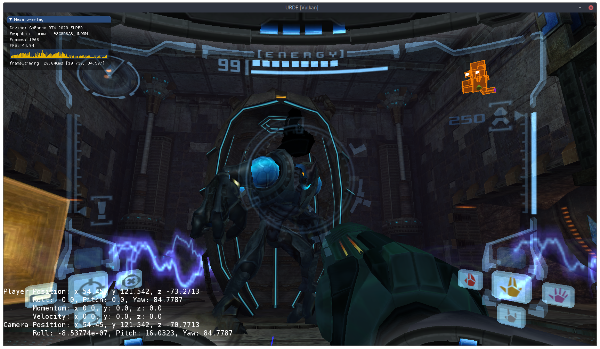

## URDE
**Status:** Metroid Prime 1 In-Game (all retail GC & Wii versions)

**Official Discord Channel:** https://discord.gg/AMBVFuf



### Download
Precompiled builds of the command-line extraction utility (`hecl`) with embedded dataspec libraries are available at https://releases.axiodl.com. This will give you intermediate dumps of original formats as *blender* and *yaml* representations.

Everything else is much too experimental to make portable/stable release builds (for now)

### Platform Support
* Windows 10 (64-bit, D3D11 / Vulkan)
* macOS 10.15+ (Metal)
* Linux (Vulkan)
    * Arch is known to function with [`glx` vendor setup instructions](https://wiki.archlinux.org/index.php/Category:Graphics) *(main development/testing OS)*
    * Other distros with reasonably up-to-date packages will work (specific packages TBD)
    
### Usage (GC versions)

* Extract ISO: `hecl extract [path].iso -o mp1`
  * `mp1` can be substituted with the directory name of your choice
* Repackage game for URDE: `cd mp1; hecl package`
* Run URDE: `urde mp1/out`

### Usage (Wii versions)

NFS files dumped from Metroid Prime Trilogy on Wii U VC can be used directly without converting to ISO.

* Extract ISO or NFS: `hecl extract [path].[iso/nfs] -o mpt`
  * `mpt` can be substituted with the directory name of your choice
* Repackage game for URDE: `cd mpt; hecl package MP1`
  * The `MP1` parameter is important here.
* Run URDE: `urde mpt/out`

#### URDE options (non-exhaustive)

* `-l`: Enable console logging
* `--warp [worldid] [areaid]`: Warp to a specific world/area. Example: `--warp 2 2`
* `+developer=1`: Enable developer console

### Build Prerequisites:
* [CMake 3.13+](https://cmake.org)
    * Windows: Install `CMake Tools` in Visual Studio
    * macOS: `brew install cmake`
* [Python 3+](https://python.org)
    * Windows: [Microsoft Store](https://go.microsoft.com/fwlink?linkID=2082640)
        * Verify it's added to `%PATH%` by typing `python` in `cmd`.
    * macOS: `brew install python@3`
* LLVM development package *(headers and libs)*
    * [Specialized Windows Package](https://axiodl.com/files/LLVM-10.0.1-win64.exe)
    * macOS: `brew install --force-bottle llvm`
* **[Windows]** [Visual Studio 2019 Community](https://www.visualstudio.com/en-us/products/visual-studio-community-vs.aspx)
    * Select `C++ Development` and verify the following packages are included:
        * `Windows 10 SDK`
        * `CMake Tools`
        * `C++ Clang Compiler`
        * `C++ Clang-cl`
* **[macOS]** [Xcode 1.15+](https://developer.apple.com/xcode/download/)
* **[Linux]** recent development packages of `udev`, `x11`, `xcb`, `xinput`, `glx`, `asound`

### Prep Directions

```sh
git clone --recursive https://github.com/AxioDL/urde.git
mkdir urde-build
cd urde-build
```

### Update Directions

```sh
cd urde
git pull
git submodule update --recursive
```

### Build Directions

For Windows, it's recommended to use Visual Studio. See below.

#### ninja (Windows/macOS/Linux)

```sh
cd urde-build
cmake -DCMAKE_BUILD_TYPE=Debug -G Ninja ../urde
ninja
```

#### CMake options
- Build release optimized (better runtime performance): `-DCMAKE_BUILD_TYPE=Release`
- Use clang+lld (faster linking): `-DCMAKE_C_COMPILER=clang -DCMAKE_CXX_COMPILER=clang++`
- Optimize for current CPU (resulting binaries are not portable): `-DURDE_VECTOR_ISA=native`

#### CLion (Windows/macOS/Linux)
*(main development / debugging IDE)*

Open the repository's `CMakeLists.txt`.

Optionally configure CMake options via `File` > `Settings` > `Build, Execution, Deployment` > `CMake`.

#### Qt Creator (Windows/macOS/Linux)

Open the repository's `CMakeLists.txt` via File > Open File or Project.

Configure the desired CMake targets to build in the *Projects* area of the IDE.

#### Visual Studio (Windows)

Verify all required VS packages are installed from the above **Build Prerequisites** section.

Open the `urde` directory in Visual Studio (imports CMake configuration).

MSVC and clang-cl configurations should import automatically.

#### Xcode (macOS)

```sh
cmake -G Xcode ../urde
```

Then open `urde.xcodeproj`
